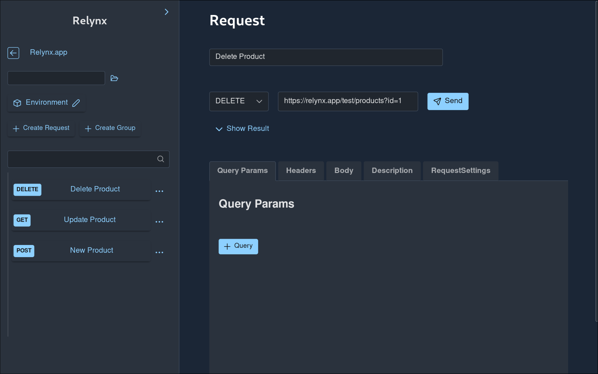

# Relynx

Relynx is an HTTP client desktop application that can send the usual HTTP requests for testing API REST endpoints.

Requests are stored locally on your file system in the same format that the [Jetbrains HTTP client](https://www.jetbrains.com/help/idea/http-client-in-product-code-editor.html)
uses and is compatible with it although does not provide feature parity.

As Relynx stores requests as files and groups as folders on your file system this allows you to backup and share all requests with
git.

If you want to use this software get it on [relynx.app](https://relynx.app).

Relynx is written in Rust and React using [tauri](https://github.com/tauri-apps/tauri) to create a desktop application.

It uses parts of [hurl](https://github.com/Orange-OpenSource/hurl) which is a cli request client that uses a different file format.

## Get Relynx

Please visit [relynx.app](https://relynx.app) to obtain a license. There is also a trial version available.
